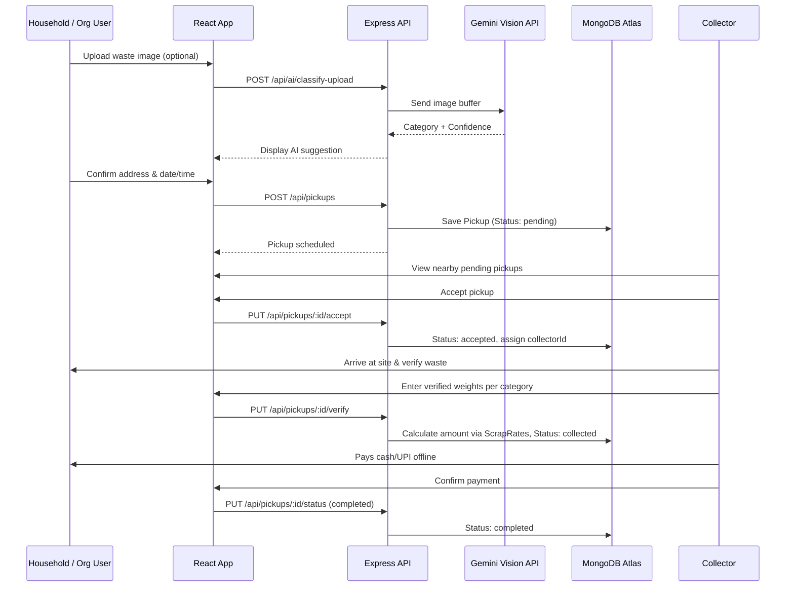
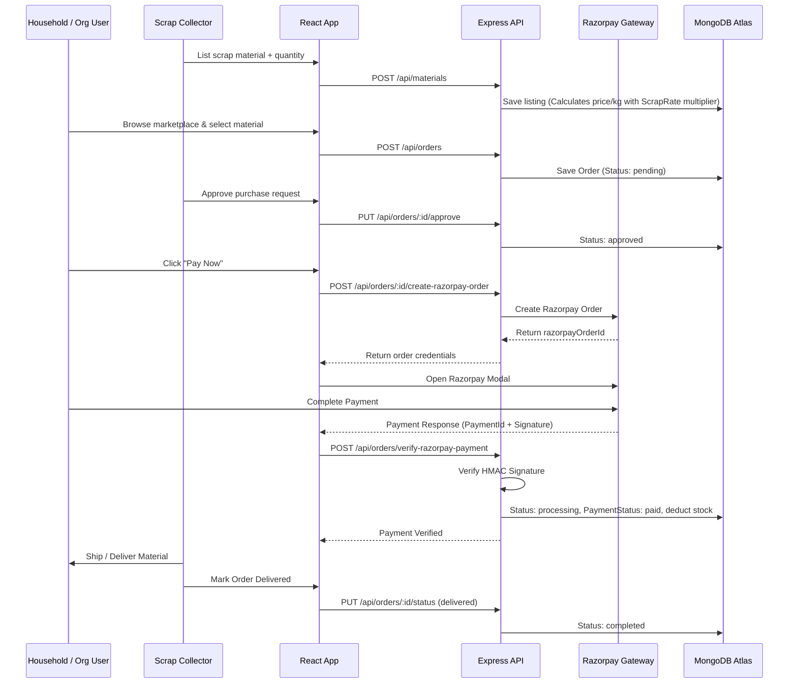
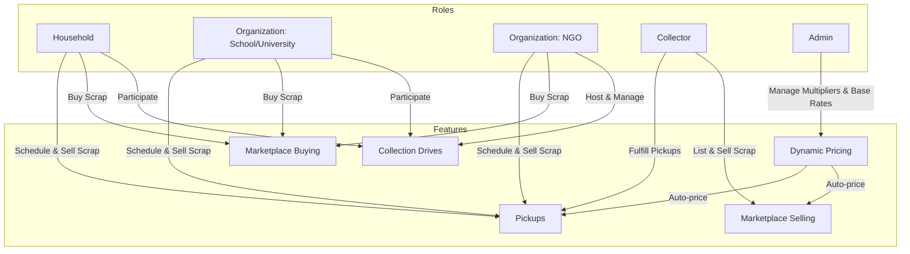

# Eco Setu — System Architecture Document (v2)

> **Source of Truth:** PROJECT_SPEC.md (v2)

---

## 1. High Level Architecture

```mermaid
flowchart TB
    subgraph Client Tier
        HH["Household Web App"]
        ORG["Organization Web App<br/>(School / University / NGO)"]
        COL["Collector Web App"]
        ADM["Admin Web App"]
    end

    subgraph Service Integrations
        FA["Firebase Auth"]
        GM["Google Maps API"]
        RZ["Razorpay Checkout"]
    end

    subgraph Backend Tier (Express.js)
        API["API Gateway / App"]
        MW["Middleware<br/>(Auth & RBAC)"]
        
        subgraph Business Logic Services
            AUTH_S["Auth Service"]
            PICK_S["Pickup Service"]
            PRIC_S["Pricing & Market Engine"]
            ORD_S["Order & Razorpay Service"]
            DRV_S["NGO Drive Service"]
            AI_S["Gemini AI Service"]
        end
    end

    subgraph Cloud Services & Data
        CLD["Cloudinary (Images)"]
        GEM["Google Gemini Vision"]
        MDB[("MongoDB Atlas")]
    end

    Client Tier --> FA
    Client Tier --> GM
    Client Tier --> RZ
    Client Tier --> API

    API --> MW
    MW --> Business Logic Services

    ORD_S <--> RZ
    AI_S <--> GEM
    Business Logic Services <--> CLD
    Business Logic Services <--> MDB
```

---

## 2. Request Flows & Lifecycles

### 2.1 Pickup Request Flow (Offline Payment to User)



### 2.2 Marketplace Buying Flow (Razorpay Integration)



---

## 3. Module Communication & Roles


