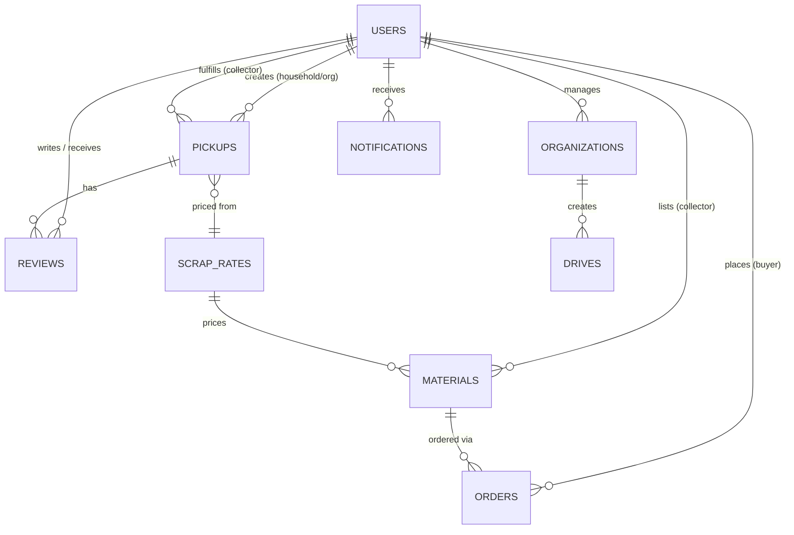
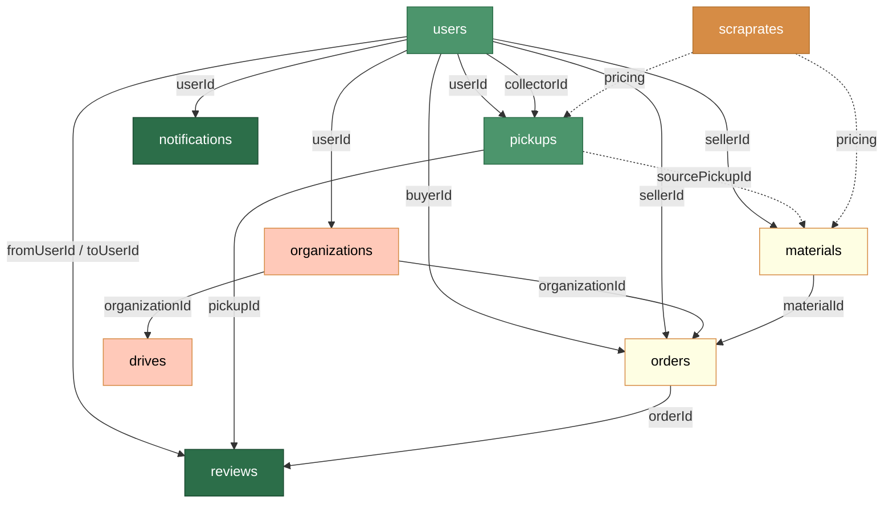

# Eco Setu — MongoDB Database Schema (v2)

> **Database:** MongoDB Atlas
> **ODM:** Mongoose
> **Source of Truth:** PROJECT_SPEC.md (v2 — restructured roles + marketplace)

---

## 1. Schema Overview



### Collections (10)

| # | Collection | Purpose |
|---|---|---|
| 1 | `users` | All platform users (household, organization, collector, admin) |
| 2 | `pickups` | Waste pickup requests and full lifecycle |
| 3 | `scraprates` | Per-category base pricing + marketplace multipliers |
| 4 | `organizations` | Registered org profiles (NGO, school, university) |
| 5 | `materials` | Marketplace listings (collector sells scrap) |
| 6 | `orders` | Marketplace purchase orders (buyer pays collector) |
| 7 | `drives` | NGO collection drives |
| 8 | `notifications` | In-app notifications |
| 9 | `reviews` | Ratings and feedback |
| 10 | `analytics` | Pre-aggregated sustainability metrics |

---

## 2. Enums & Constants

### User Roles (4 roles)

| Value | Description |
|---|---|
| `household` | Individual residential users |
| `organization` | NGO, school, or university (subtype field determines which) |
| `collector` | Verified scrap collectors |
| `admin` | Platform administrators |

### Organization SubTypes

| Value | Description | Dashboard |
|---|---|---|
| `ngo` | Non-governmental organizations | NGO Dashboard (with Drives) |
| `school` | K-12 educational institutions | Organization Dashboard (shared) |
| `university` | Higher education institutions | Organization Dashboard (shared) |

### Pickup Statuses

| Value | Who Triggers |
|---|---|
| `pending` | System (on creation) |
| `accepted` | Collector |
| `collector_assigned` | System / Admin |
| `on_the_way` | Collector |
| `collected` | Collector |
| `delivered` | Collector |
| `completed` | System |
| `cancelled` | User / Collector |

### Pickup Types

| Value | Cost |
|---|---|
| `scheduled` | Free |
| `instant` | Service charge applies |

### Waste Categories

| Value | Status |
|---|---|
| `plastic` | Active |
| `glass` | Active |
| `paper` | Active |
| `cardboard` | Active |
| `metal` | Active |
| `e_waste` | Active |
| `mixed_waste` | Active |
| `organic` | Future |
| `textile` | Future |

### Order Statuses (Marketplace)

| Value | Description |
|---|---|
| `pending` | Order placed, awaiting collector approval |
| `approved` | Collector approved, awaiting payment |
| `paid` | Payment completed via Razorpay |
| `processing` | Collector preparing material |
| `shipped` | Material dispatched |
| `delivered` | Material delivered to buyer |
| `completed` | Order cycle finished |
| `cancelled` | Order cancelled |
| `refunded` | Payment refunded |

### Payment Statuses

| Value | Used In |
|---|---|
| `pending` | Pickup (offline), Order (Razorpay) |
| `paid` | Both |
| `donated` | Pickup only (user donated scrap) |
| `refunded` | Order only |

### Drive Statuses

| Value | Description |
|---|---|
| `draft` | Created but not published |
| `active` | Published and accepting participation |
| `completed` | Drive dates have passed, results tallied |
| `cancelled` | Drive cancelled |

---

## 3. Collection Schemas

### 3.1 Users

| Field | Type | Required | Default | Description |
|---|---|---|---|---|
| `_id` | `ObjectId` | Auto | — | Primary key |
| `firebaseUid` | `String` | ✅ | — | Firebase UID (unique) |
| `name` | `String` | ✅ | — | Full name |
| `email` | `String` | ✅ | — | Email (unique, from Firebase) |
| `phone` | `String` | ❌ | `null` | Phone number |
| `role` | `String` | ✅ | — | `household` \| `organization` \| `collector` \| `admin` |
| `organizationType` | `String` | ❌ | `null` | `ngo` \| `school` \| `university` (only when role=organization) |
| `profileImage` | `String` | ❌ | `null` | Cloudinary URL |
| `address` | `Object` | ❌ | `{}` | Embedded address |
| `address.street` | `String` | ❌ | — | Street |
| `address.city` | `String` | ❌ | — | City |
| `address.state` | `String` | ❌ | — | State |
| `address.pincode` | `String` | ❌ | — | PIN code |
| `address.coordinates` | `Object` | ❌ | — | `{ lat, lng }` |
| `isVerified` | `Boolean` | ❌ | `false` | Admin-verified (primarily for collectors) |
| `isActive` | `Boolean` | ❌ | `true` | Soft-delete / suspension flag |
| `totalPickups` | `Number` | ❌ | `0` | Completed pickups count |
| `totalWeightRecycled` | `Number` | ❌ | `0` | Total kg recycled |
| `totalEarnings` | `Number` | ❌ | `0` | Collector: pickup earnings |
| `totalMarketplaceRevenue` | `Number` | ❌ | `0` | Collector: marketplace sales revenue |
| `razorpayContactId` | `String` | ❌ | `null` | Razorpay contact ID (for payouts to collectors, future) |
| `createdAt` | `Date` | Auto | `Date.now` | — |
| `updatedAt` | `Date` | Auto | `Date.now` | — |

#### Role-Field Relevance

| Field | household | organization | collector | admin |
|---|---|---|---|---|
| `organizationType` | ❌ | ✅ | ❌ | ❌ |
| `isVerified` | ❌ | ❌ | ✅ | ❌ |
| `totalEarnings` | ❌ | ❌ | ✅ | ❌ |
| `totalMarketplaceRevenue` | ❌ | ❌ | ✅ | ❌ |
| `totalPickups` | ✅ | ✅ | ✅ | ❌ |

---

### 3.2 Pickups

| Field | Type | Required | Default | Description |
|---|---|---|---|---|
| `_id` | `ObjectId` | Auto | — | Primary key |
| `userId` | `ObjectId` | ✅ | — | Ref → `users` (creator) |
| `collectorId` | `ObjectId` | ❌ | `null` | Ref → `users` (assigned collector) |
| `pickupType` | `String` | ✅ | `scheduled` | `scheduled` \| `instant` |
| `estimatedCategory` | `String` | ❌ | `null` | User's category estimate |
| `estimatedWeight` | `Number` | ❌ | `null` | User's weight estimate (kg) |
| `imageUrls` | `[String]` | ❌ | `[]` | Cloudinary URLs |
| `aiPrediction` | `Object` | ❌ | `null` | `{ materialType, recyclability, confidenceScore, rawResponse }` |
| `userSelectedCategory` | `String` | ❌ | `null` | User's chosen category |
| `verifiedCategories` | `[Object]` | ❌ | `[]` | Collector's final: `[{ category, weight, ratePerKg, amount }]` |
| `totalAmount` | `Number` | ❌ | `0` | Sum of verified amounts |
| `paymentStatus` | `String` | ❌ | `pending` | `pending` \| `paid` \| `donated` |
| `isDonation` | `Boolean` | ❌ | `false` | User chose to donate |
| `status` | `String` | ✅ | `pending` | Pickup lifecycle status |
| `pickupAddress` | `Object` | ✅ | — | `{ street, city, state, pincode, coordinates }` |
| `pickupDate` | `Date` | ✅ | — | Scheduled date |
| `pickupTimeSlot` | `String` | ❌ | `null` | e.g., `"9AM-12PM"` |
| `notes` | `String` | ❌ | `null` | User notes |
| `statusHistory` | `[Object]` | ❌ | `[]` | `[{ status, changedBy, changedAt, note }]` |
| `serviceCharge` | `Number` | ❌ | `0` | Instant pickup charge |
| `createdAt` | `Date` | Auto | `Date.now` | — |
| `updatedAt` | `Date` | Auto | `Date.now` | — |

---

### 3.3 ScrapRates

| Field | Type | Required | Default | Description |
|---|---|---|---|---|
| `_id` | `ObjectId` | Auto | — | Primary key |
| `category` | `String` | ✅ | — | Waste category (unique) |
| `displayName` | `String` | ✅ | — | Human label (e.g., "E-Waste") |
| `unit` | `String` | ✅ | `kg` | Measurement unit |
| `pricePerKg` | `Number` | ✅ | — | Base rate — what collector pays household (₹/kg) |
| `marketMultiplier` | `Number` | ✅ | `1.5` | Marketplace selling price multiplier (1.3–2.0) |
| `quantityDiscountTiers` | `[Object]` | ❌ | default tiers | `[{ minKg, maxKg, factor }]` |
| `minWeight` | `Number` | ❌ | `0` | Minimum weight accepted |
| `isActive` | `Boolean` | ❌ | `true` | Category active status |
| `lastUpdated` | `Date` | ✅ | `Date.now` | Last rate change |
| `updatedBy` | `ObjectId` | ❌ | — | Ref → `users` (admin) |
| `priceHistory` | `[Object]` | ❌ | `[]` | `[{ price, multiplier, changedAt, changedBy }]` |

#### Default Seed Data

| Category | Base Rate (₹/kg) | Market Multiplier | Selling Price (₹/kg) |
|---|---|---|---|
| `plastic` | 18 | 1.5× | 27.00 |
| `glass` | 4 | 1.8× | 7.20 |
| `paper` | 12 | 1.5× | 18.00 |
| `cardboard` | 10 | 1.5× | 15.00 |
| `metal` | 35 | 1.4× | 49.00 |
| `e_waste` | 25 | 1.6× | 40.00 |
| `mixed_waste` | 5 | 1.3× | 6.50 |

#### Default Quantity Discount Tiers

```
[
  { minKg: 0,  maxKg: 10, factor: 1.0  },   // no discount
  { minKg: 11, maxKg: 50, factor: 0.95 },   // 5% off
  { minKg: 51, maxKg: null, factor: 0.90 }  // 10% off
]
```

---

### 3.4 Organizations

| Field | Type | Required | Default | Description |
|---|---|---|---|---|
| `_id` | `ObjectId` | Auto | — | Primary key |
| `userId` | `ObjectId` | ✅ | — | Ref → `users` (owner, must have role=organization) |
| `name` | `String` | ✅ | — | Organization name |
| `type` | `String` | ✅ | — | `ngo` \| `school` \| `university` |
| `description` | `String` | ❌ | `null` | Description |
| `location` | `Object` | ❌ | `{}` | `{ address, city, state, pincode, coordinates }` |
| `contactInfo` | `Object` | ❌ | `{}` | `{ email, phone, website }` |
| `isVerified` | `Boolean` | ❌ | `false` | Admin verification |
| `categoriesAccepted` | `[String]` | ❌ | `[]` | Waste categories this org accepts |
| `createdAt` | `Date` | Auto | `Date.now` | — |
| `updatedAt` | `Date` | Auto | `Date.now` | — |

---

### 3.5 Materials (Marketplace Listings)

| Field | Type | Required | Default | Description |
|---|---|---|---|---|
| `_id` | `ObjectId` | Auto | — | Primary key |
| `sellerId` | `ObjectId` | ✅ | — | Ref → `users` (must be collector) |
| `category` | `String` | ✅ | — | Waste category |
| `quantity` | `Number` | ✅ | — | Available quantity (kg) |
| `quantitySold` | `Number` | ❌ | `0` | Quantity already sold (kg) |
| `quantityAvailable` | `Number` | ✅ | — | `quantity - quantitySold` (computed) |
| `source` | `String` | ❌ | `null` | Origin description |
| `sourcePickupId` | `ObjectId` | ❌ | `null` | Ref → `pickups` |
| `condition` | `String` | ❌ | `good` | `good` \| `fair` \| `poor` |
| `imageUrls` | `[String]` | ❌ | `[]` | Cloudinary URLs |
| `sellingPricePerKg` | `Number` | ✅ | — | Algorithm-calculated price |
| `location` | `Object` | ❌ | `{}` | `{ city, state }` |
| `status` | `String` | ✅ | `available` | `available` \| `sold_out` \| `delisted` |
| `createdAt` | `Date` | Auto | `Date.now` | — |
| `updatedAt` | `Date` | Auto | `Date.now` | — |

#### Marketplace Pricing Calculation (stored on creation/update)

```
sellingPricePerKg = ScrapRates.pricePerKg × ScrapRates.marketMultiplier
```

> The quantity discount is applied at ORDER time, not on the listing itself.

---

### 3.6 Orders (Marketplace Purchases)

| Field | Type | Required | Default | Description |
|---|---|---|---|---|
| `_id` | `ObjectId` | Auto | — | Primary key |
| `buyerId` | `ObjectId` | ✅ | — | Ref → `users` (household or organization) |
| `sellerId` | `ObjectId` | ✅ | — | Ref → `users` (collector) |
| `materialId` | `ObjectId` | ✅ | — | Ref → `materials` |
| `organizationId` | `ObjectId` | ❌ | `null` | Ref → `organizations` (if buyer is org) |
| `quantityOrdered` | `Number` | ✅ | — | Quantity in kg |
| `pricePerKg` | `Number` | ✅ | — | Price at time of order (snapshot) |
| `quantityDiscount` | `Number` | ✅ | `1.0` | Discount factor applied |
| `subtotal` | `Number` | ✅ | — | `quantityOrdered × pricePerKg × quantityDiscount` |
| `platformFee` | `Number` | ❌ | `0` | Platform commission (future) |
| `totalPrice` | `Number` | ✅ | — | `subtotal + platformFee` |
| `status` | `String` | ✅ | `pending` | Order lifecycle status |
| `paymentStatus` | `String` | ✅ | `pending` | `pending` \| `paid` \| `refunded` |
| `razorpayOrderId` | `String` | ❌ | `null` | Razorpay order ID |
| `razorpayPaymentId` | `String` | ❌ | `null` | Razorpay payment ID |
| `razorpaySignature` | `String` | ❌ | `null` | Razorpay signature (verification) |
| `purpose` | `String` | ❌ | `null` | Why buyer needs the material |
| `deliveryAddress` | `Object` | ✅ | — | `{ street, city, state, pincode, coordinates }` |
| `notes` | `String` | ❌ | `null` | Additional notes |
| `cancelReason` | `String` | ❌ | `null` | Reason if cancelled |
| `deliveredAt` | `Date` | ❌ | `null` | Delivery timestamp |
| `createdAt` | `Date` | Auto | `Date.now` | — |
| `updatedAt` | `Date` | Auto | `Date.now` | — |

---

### 3.7 Drives (NGO Collection Drives)

| Field | Type | Required | Default | Description |
|---|---|---|---|---|
| `_id` | `ObjectId` | Auto | — | Primary key |
| `organizationId` | `ObjectId` | ✅ | — | Ref → `organizations` (NGO only) |
| `createdBy` | `ObjectId` | ✅ | — | Ref → `users` |
| `title` | `String` | ✅ | — | Drive name |
| `description` | `String` | ❌ | `null` | Drive description |
| `targetWeightKg` | `Number` | ❌ | `null` | Goal weight to collect |
| `collectedWeightKg` | `Number` | ❌ | `0` | Actual weight collected so far |
| `categories` | `[String]` | ❌ | `[]` | Target waste categories |
| `location` | `Object` | ✅ | — | `{ address, city, state, pincode, coordinates }` |
| `startDate` | `Date` | ✅ | — | Drive start date |
| `endDate` | `Date` | ✅ | — | Drive end date |
| `status` | `String` | ✅ | `draft` | `draft` \| `active` \| `completed` \| `cancelled` |
| `imageUrl` | `String` | ❌ | `null` | Drive banner image |
| `participantCount` | `Number` | ❌ | `0` | Number of participants |
| `participants` | `[ObjectId]` | ❌ | `[]` | Refs → `users` who participated |
| `createdAt` | `Date` | Auto | `Date.now` | — |
| `updatedAt` | `Date` | Auto | `Date.now` | — |

---

### 3.8 Notifications

| Field | Type | Required | Default | Description |
|---|---|---|---|---|
| `_id` | `ObjectId` | Auto | — | Primary key |
| `userId` | `ObjectId` | ✅ | — | Ref → `users` (recipient) |
| `type` | `String` | ✅ | — | Notification type |
| `title` | `String` | ✅ | — | Title |
| `message` | `String` | ✅ | — | Body text |
| `read` | `Boolean` | ❌ | `false` | Read status |
| `actionUrl` | `String` | ❌ | `null` | Deep link |
| `relatedId` | `ObjectId` | ❌ | `null` | Related document ID |
| `relatedModel` | `String` | ❌ | `null` | `Pickup` \| `Order` \| `Drive` etc. |
| `createdAt` | `Date` | Auto | `Date.now` | — |

#### Notification Types

| Type | Trigger |
|---|---|
| `pickup_accepted` | Collector accepts pickup |
| `pickup_status_update` | Any pickup status change |
| `pickup_completed` | Pickup cycle complete |
| `order_placed` | Buyer places marketplace order |
| `order_approved` | Collector approves order |
| `order_paid` | Razorpay payment confirmed |
| `order_shipped` | Material dispatched |
| `order_delivered` | Material delivered |
| `order_cancelled` | Order cancelled |
| `drive_published` | NGO publishes a drive |
| `drive_reminder` | Drive starting soon |
| `account_verified` | Admin verifies collector |
| `rate_updated` | Scrap rates changed |
| `new_review` | Review posted |

---

### 3.9 Reviews

| Field | Type | Required | Default | Description |
|---|---|---|---|---|
| `_id` | `ObjectId` | Auto | — | Primary key |
| `fromUserId` | `ObjectId` | ✅ | — | Ref → `users` (reviewer) |
| `toUserId` | `ObjectId` | ✅ | — | Ref → `users` (reviewed) |
| `pickupId` | `ObjectId` | ❌ | `null` | Ref → `pickups` |
| `orderId` | `ObjectId` | ❌ | `null` | Ref → `orders` |
| `rating` | `Number` | ✅ | — | 1–5 stars |
| `comment` | `String` | ❌ | `null` | Feedback text |
| `tags` | `[String]` | ❌ | `[]` | e.g., `"punctual"`, `"accurate_weight"` |
| `createdAt` | `Date` | Auto | `Date.now` | — |

---

### 3.10 Analytics

| Field | Type | Required | Default | Description |
|---|---|---|---|---|
| `_id` | `ObjectId` | Auto | — | Primary key |
| `scope` | `String` | ✅ | `platform` | `platform` \| `city` \| `user` |
| `scopeId` | `String` | ❌ | `null` | City name or user ID |
| `period` | `String` | ✅ | — | e.g., `"2026-07"`, `"all_time"` |
| `periodStart` | `Date` | ✅ | — | Period start |
| `periodEnd` | `Date` | ✅ | — | Period end |
| `totalWasteRecycled` | `Number` | ❌ | `0` | Total kg recycled |
| `pickupsCompleted` | `Number` | ❌ | `0` | Completed pickups |
| `carbonSaved` | `Number` | ❌ | `0` | CO₂ saved (kg) |
| `treesEquivalent` | `Number` | ❌ | `0` | Trees saved |
| `totalPickupPayments` | `Number` | ❌ | `0` | ₹ in pickup transactions |
| `totalMarketplaceRevenue` | `Number` | ❌ | `0` | ₹ in marketplace sales |
| `totalOrders` | `Number` | ❌ | `0` | Marketplace orders |
| `totalDrives` | `Number` | ❌ | `0` | NGO drives conducted |
| `categoryBreakdown` | `Object` | ❌ | `{}` | `{ plastic: 120, glass: 45 }` |
| `activeUsers` | `Number` | ❌ | `0` | Active users in period |
| `lastCalculatedAt` | `Date` | ❌ | `Date.now` | Last recompute |

---

## 4. Relationships & Reference Map



---

## 5. Indexing Strategy

### Unique Indexes

| Collection | Field(s) |
|---|---|
| `users` | `firebaseUid`, `email` |
| `scraprates` | `category` |

### Query Performance Indexes

| Collection | Fields | Purpose |
|---|---|---|
| `users` | `role` | Filter by role |
| `users` | `role, organizationType` | Filter organizations by subtype |
| `users` | `isVerified, role` | Unverified collectors |
| `pickups` | `userId` | User's pickups |
| `pickups` | `collectorId` | Collector's pickups |
| `pickups` | `status, pickupDate` | Available pickups |
| `pickups` | `pickupAddress.coordinates` | 2dsphere geospatial |
| `materials` | `category, status` | Marketplace browse |
| `materials` | `sellerId` | Collector's listings |
| `orders` | `buyerId` | Buyer's orders |
| `orders` | `sellerId` | Seller's orders |
| `orders` | `status` | Order queue |
| `orders` | `razorpayOrderId` | Payment lookup |
| `drives` | `organizationId` | Org's drives |
| `drives` | `status, startDate` | Active drives |
| `notifications` | `userId, read` | Unread per user |
| `notifications` | `userId, createdAt` | Feed (sorted) |
| `reviews` | `toUserId` | User's reviews |
| `analytics` | `scope, period` | Dashboard lookups |

---

## 6. Validation Rules

### Users
| Field | Rule |
|---|---|
| `name` | 2-100 chars |
| `email` | Valid email format |
| `phone` | 10-digit Indian number |
| `role` | Must be `household` \| `organization` \| `collector` \| `admin` |
| `organizationType` | Required if role=organization; must be `ngo` \| `school` \| `university` |

### Orders
| Field | Rule |
|---|---|
| `quantityOrdered` | Positive, ≤ material's `quantityAvailable` |
| `buyerId` | Cannot equal `sellerId` |

### Reviews
| Field | Rule |
|---|---|
| `rating` | Integer 1-5 |
| `fromUserId` | Cannot equal `toUserId` |
| Uniqueness | One review per user per pickup/order |

### Status Transitions
| Pickup | `pending→accepted→collector_assigned→on_the_way→collected→delivered→completed` |
|---|---|
| Order | `pending→approved→paid→processing→shipped→delivered→completed` |
| Drive | `draft→active→completed` |

---

## 7. Future Scalability

| Area | Current | Future |
|---|---|---|
| Payment | Razorpay (marketplace) + offline (pickup) | Razorpay for both + payouts to collectors |
| Categories | 7 active + 2 reserved | Add without code changes via ScrapRates |
| Multi-city | Embedded address | `cities` collection with zones |
| Chat | None | `conversations` + `messages` collections |
| Gamification | Denormalized counters | `achievements`, `badges`, `leaderboard` |
| Subscriptions | None | `subscriptions` for premium plans |
| Recycler role | NGO subtype handles | Separate `recycler` organization subtype |
