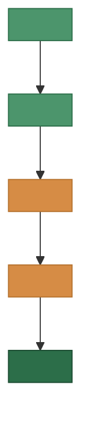
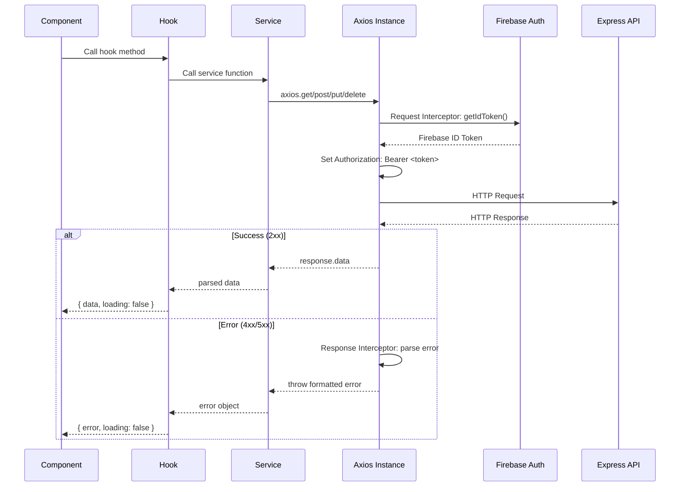
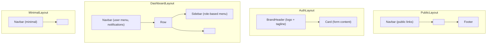

# Eco Setu — Frontend Folder Structure

> **Stack:** React · React Router · Tailwind CSS · Framer Motion · Axios · React Icons
> **Pattern:** Feature-based organization with shared component library
> **Source of Truth:** PROJECT_SPEC.md

---

## Complete Directory Tree

```
frontend/
│
├── public/
│   ├── favicon.ico                             # Site favicon (green leaf icon)
│   ├── logo192.png                             # PWA icon (192×192)
│   ├── logo512.png                             # PWA icon (512×512)
│   ├── manifest.json                           # PWA manifest
│   ├── robots.txt                              # SEO crawler instructions
│   └── index.html                              # HTML entry point with meta tags
│
├── src/
│   │
│   ├── assets/                                 # Static assets (images, fonts, icons)
│   │   ├── images/
│   │   │   ├── logo.svg                        # Eco Setu primary logo
│   │   │   ├── logo-dark.svg                   # Logo variant for dark backgrounds
│   │   │   ├── logo-icon.svg                   # Icon-only mark (no text)
│   │   │   ├── hero-illustration.svg           # Landing page hero illustration
│   │   │   ├── empty-state.svg                 # Illustration for empty lists/states
│   │   │   ├── onboarding-1.svg                # Onboarding step 1 illustration
│   │   │   ├── onboarding-2.svg                # Onboarding step 2 illustration
│   │   │   ├── onboarding-3.svg                # Onboarding step 3 illustration
│   │   │   ├── error-404.svg                   # 404 page illustration
│   │   │   ├── error-500.svg                   # 500 page illustration
│   │   │   └── sdg-badges/                     # SDG alignment badge icons
│   │   │       ├── sdg-8.svg
│   │   │       ├── sdg-9.svg
│   │   │       ├── sdg-11.svg
│   │   │       ├── sdg-12.svg
│   │   │       ├── sdg-13.svg
│   │   │       └── sdg-17.svg
│   │   ├── fonts/                              # Custom font files (if self-hosted)
│   │   │   └── .gitkeep
│   │   └── icons/
│   │       ├── waste-categories/               # Category icons for waste types
│   │       │   ├── plastic.svg
│   │       │   ├── glass.svg
│   │       │   ├── paper.svg
│   │       │   ├── cardboard.svg
│   │       │   ├── metal.svg
│   │       │   ├── e-waste.svg
│   │       │   └── mixed-waste.svg
│   │       └── features/                       # Feature icons for landing page
│   │           ├── ai-classify.svg
│   │           ├── schedule-pickup.svg
│   │           ├── track-impact.svg
│   │           └── marketplace.svg
│   │
│   ├── components/                             # Shared/reusable UI components
│   │   ├── ui/                                 # Atomic design system components
│   │   │   ├── Button.jsx                      # Primary, secondary, ghost, danger variants
│   │   │   ├── Input.jsx                       # Text input with label, error, helper text
│   │   │   ├── Textarea.jsx                    # Multi-line text input
│   │   │   ├── Select.jsx                      # Dropdown select with custom styling
│   │   │   ├── Checkbox.jsx                    # Checkbox with label
│   │   │   ├── RadioGroup.jsx                  # Radio button group
│   │   │   ├── Toggle.jsx                      # Toggle switch
│   │   │   ├── Badge.jsx                       # Status badges (pending, completed, etc.)
│   │   │   ├── Avatar.jsx                      # User avatar with fallback initials
│   │   │   ├── Card.jsx                        # Content card with glassmorphism
│   │   │   ├── Modal.jsx                       # Overlay modal with backdrop blur
│   │   │   ├── Drawer.jsx                      # Slide-in drawer (mobile nav, filters)
│   │   │   ├── Tooltip.jsx                     # Hover/focus tooltip
│   │   │   ├── Dropdown.jsx                    # Dropdown menu (actions, options)
│   │   │   ├── Tabs.jsx                        # Tabbed content switcher
│   │   │   ├── Accordion.jsx                   # Expandable/collapsible sections
│   │   │   ├── Skeleton.jsx                    # Loading skeleton placeholders
│   │   │   ├── Spinner.jsx                     # Loading spinner animation
│   │   │   ├── ProgressBar.jsx                 # Progress bar (pickup progress, upload)
│   │   │   ├── EmptyState.jsx                  # Empty state with illustration and CTA
│   │   │   ├── Divider.jsx                     # Horizontal/vertical divider
│   │   │   └── Tag.jsx                         # Small tag/chip (categories, filters)
│   │   │
│   │   ├── layout/                             # Layout structure components
│   │   │   ├── Navbar.jsx                      # Top navigation bar (logo, nav links, user menu)
│   │   │   ├── Sidebar.jsx                     # Dashboard sidebar navigation
│   │   │   ├── Footer.jsx                      # Site footer (links, socials, copyright)
│   │   │   ├── MobileNav.jsx                   # Bottom tab navigation for mobile
│   │   │   ├── PageHeader.jsx                  # Page title + breadcrumb + action buttons
│   │   │   ├── Container.jsx                   # Max-width content container
│   │   │   └── BrandHeader.jsx                 # Logo + tagline header (auth pages)
│   │   │
│   │   ├── feedback/                           # User feedback components
│   │   │   ├── Toast.jsx                       # Toast notification popup
│   │   │   ├── Alert.jsx                       # Inline alert banner (info, success, warning, error)
│   │   │   ├── ConfirmDialog.jsx               # Confirmation dialog (delete, cancel actions)
│   │   │   └── ErrorBoundary.jsx               # React error boundary with fallback UI
│   │   │
│   │   ├── data-display/                       # Data presentation components
│   │   │   ├── DataTable.jsx                   # Sortable, paginated table
│   │   │   ├── StatCard.jsx                    # Metric card (number, label, icon, trend)
│   │   │   ├── StatusBadge.jsx                 # Pickup status with color coding
│   │   │   ├── UserCard.jsx                    # User info card (avatar, name, role)
│   │   │   ├── RatingStars.jsx                 # Star rating display + input
│   │   │   ├── PriceBreakdown.jsx              # Waste category × weight × rate table
│   │   │   ├── Timeline.jsx                    # Vertical timeline (pickup status history)
│   │   │   └── CategoryIcon.jsx                # Waste category icon renderer
│   │   │
│   │   ├── forms/                              # Reusable form components
│   │   │   ├── ImageUploader.jsx               # Drag-and-drop image upload with preview
│   │   │   ├── AddressInput.jsx                # Google Maps address autocomplete
│   │   │   ├── DatePicker.jsx                  # Date selection input
│   │   │   ├── TimeSlotPicker.jsx              # Time slot selector (9AM-12PM, etc.)
│   │   │   ├── CategorySelector.jsx            # Waste category multi-select with icons
│   │   │   ├── WeightInput.jsx                 # Weight input with unit label (kg)
│   │   │   ├── SearchInput.jsx                 # Search bar with debounce
│   │   │   └── FormField.jsx                   # Label + input + error wrapper
│   │   │
│   │   ├── charts/                             # Dashboard chart components
│   │   │   ├── BarChart.jsx                    # Bar chart (pickups by month, etc.)
│   │   │   ├── PieChart.jsx                    # Pie/donut chart (waste category split)
│   │   │   ├── LineChart.jsx                   # Line chart (trends over time)
│   │   │   └── ImpactGauge.jsx                 # Circular gauge (CO₂ saved, trees)
│   │   │
│   │   └── shared/                             # Cross-cutting shared components
│   │       ├── ProtectedRoute.jsx              # Route guard: auth + role check
│   │       ├── RoleGate.jsx                    # Conditionally render by user role
│   │       ├── NotificationBell.jsx            # Navbar notification icon + badge count
│   │       ├── AIPredictionCard.jsx            # AI classification result display
│   │       ├── PickupCard.jsx                  # Pickup summary card (reused in lists)
│   │       ├── MaterialCard.jsx                # Material listing card (marketplace)
│   │       ├── RequestCard.jsx                 # Material request card
│   │       ├── ReviewCard.jsx                  # Review display card
│   │       ├── MapView.jsx                     # Google Maps wrapper component
│   │       └── SustainabilityImpact.jsx        # Impact metrics row (CO₂, trees, weight)
│   │
│   ├── contexts/                               # React Context providers
│   │   ├── AuthContext.jsx                     # Firebase auth state, user profile, login/logout methods
│   │   ├── ThemeContext.jsx                    # Light/dark mode toggle and persistence
│   │   ├── NotificationContext.jsx             # Real-time notification state and unread count
│   │   └── ToastContext.jsx                    # Global toast notification queue
│   │
│   ├── hooks/                                  # Custom React hooks
│   │   ├── useAuth.js                          # Access AuthContext (user, role, loading, login, logout)
│   │   ├── useApi.js                           # Generic API call hook with loading/error state
│   │   ├── usePickups.js                       # Pickup CRUD operations
│   │   ├── useNotifications.js                 # Fetch, mark-read, unread count
│   │   ├── useScrapRates.js                    # Fetch current scrap rates
│   │   ├── useMaterials.js                     # Material listing CRUD
│   │   ├── useRequests.js                      # Material request operations
│   │   ├── useReviews.js                       # Review fetch and create
│   │   ├── useAnalytics.js                     # Dashboard metrics fetch
│   │   ├── useOrganizations.js                 # Organization CRUD
│   │   ├── useUsers.js                         # User profile operations
│   │   ├── useImageUpload.js                   # Cloudinary upload with progress
│   │   ├── useAIClassify.js                    # Gemini Vision classification trigger
│   │   ├── useDebounce.js                      # Debounce hook (search input)
│   │   ├── useMediaQuery.js                    # Responsive breakpoint detection
│   │   ├── usePagination.js                    # Pagination state management
│   │   ├── useLocalStorage.js                  # Persist state in localStorage
│   │   └── useGeolocation.js                   # Browser geolocation access
│   │
│   ├── services/                               # API service layer (Axios calls)
│   │   ├── api.js                              # Axios instance with baseURL, interceptors, token injection
│   │   ├── authService.js                      # POST /auth/register, /auth/login, /auth/me, /auth/logout
│   │   ├── userService.js                      # GET/PUT /users/:id, /users/me, profile image upload
│   │   ├── pickupService.js                    # POST/GET/PUT /pickups, accept, status, verify, cancel, nearby
│   │   ├── aiService.js                        # POST /ai/classify, /ai/classify-upload
│   │   ├── scrapRateService.js                 # GET/PUT /scrap-rates
│   │   ├── organizationService.js              # POST/GET/PUT /organizations
│   │   ├── materialService.js                  # POST/GET/PUT/DELETE /materials
│   │   ├── requestService.js                   # POST/GET/PUT /requests, approve, reject, fulfill
│   │   ├── notificationService.js              # GET/PUT/DELETE /notifications, unread-count, read-all
│   │   ├── reviewService.js                    # POST/GET /reviews
│   │   ├── analyticsService.js                 # GET /analytics/dashboard, /user/:id, /trends
│   │   └── adminService.js                     # GET/PUT /admin/users, verify, suspend, role, overview
│   │
│   ├── pages/                                  # Page components (one per route)
│   │   │
│   │   ├── public/                             # Pages accessible without authentication
│   │   │   ├── LandingPage.jsx                 # Hero, features, how-it-works, SDGs, CTA, footer
│   │   │   ├── AboutPage.jsx                   # Mission, team, SDG alignment
│   │   │   ├── ContactPage.jsx                 # Contact form, social links
│   │   │   └── NotFoundPage.jsx                # 404 error page with illustration
│   │   │
│   │   ├── auth/                               # Authentication pages
│   │   │   ├── LoginPage.jsx                   # Email/password login form
│   │   │   ├── SignupPage.jsx                  # Registration with role selection
│   │   │   ├── ForgotPasswordPage.jsx          # Password reset via Firebase
│   │   │   └── VerifyEmailPage.jsx             # Email verification status
│   │   │
│   │   ├── household/                          # Household user pages
│   │   │   ├── HouseholdDashboard.jsx          # Overview: recent pickups, impact stats, quick actions
│   │   │   ├── SchedulePickup.jsx              # Multi-step pickup form (images, category, address, date)
│   │   │   ├── MyPickups.jsx                   # List of all pickups with status filters
│   │   │   ├── PickupDetail.jsx                # Single pickup detail with status timeline
│   │   │   ├── Marketplace.jsx                 # Browse materials, request from NGOs
│   │   │   └── Impact.jsx                      # Personal sustainability dashboard
│   │   │
│   │   ├── school/                             # School user pages
│   │   │   ├── SchoolDashboard.jsx             # Overview: recent pickups, impact stats, org info
│   │   │   ├── SchedulePickup.jsx              # Pickup form (same flow as household)
│   │   │   ├── MyPickups.jsx                   # Pickup listing
│   │   │   ├── PickupDetail.jsx                # Pickup detail
│   │   │   ├── Marketplace.jsx                 # Browse & request materials
│   │   │   └── Impact.jsx                      # School sustainability metrics
│   │   │
│   │   ├── collector/                          # Collector user pages
│   │   │   ├── CollectorDashboard.jsx          # Overview: available pickups, earnings, stats
│   │   │   ├── AvailablePickups.jsx            # Nearby pending pickups with map view
│   │   │   ├── MyAssignedPickups.jsx           # Accepted/in-progress pickups
│   │   │   ├── PickupDetail.jsx                # Pickup detail with verify/classify actions
│   │   │   ├── VerifyWaste.jsx                 # Waste verification form (classify, weigh, price calc)
│   │   │   ├── Earnings.jsx                    # Earnings history, breakdown by period
│   │   │   └── MyMaterials.jsx                 # Manage listed materials
│   │   │
│   │   ├── ngo/                                # NGO user pages
│   │   │   ├── NGODashboard.jsx                # Overview: requests, available materials, stats
│   │   │   ├── Marketplace.jsx                 # Browse available recyclable materials
│   │   │   ├── MyRequests.jsx                  # List of material requests with status
│   │   │   ├── RequestDetail.jsx               # Single request detail
│   │   │   └── Organization.jsx                # Organization profile management
│   │   │
│   │   ├── admin/                              # Admin user pages
│   │   │   ├── AdminDashboard.jsx              # Platform overview: user counts, pickup stats, revenue
│   │   │   ├── UserManagement.jsx              # User listing, search, filter, verify, suspend
│   │   │   ├── UserDetail.jsx                  # Single user detail (admin view)
│   │   │   ├── PickupManagement.jsx            # All pickups, status filters, dispute resolution
│   │   │   ├── ScrapRateManagement.jsx         # View/edit scrap rates per category
│   │   │   ├── OrganizationManagement.jsx      # Org listing, verification
│   │   │   ├── RequestManagement.jsx           # Material requests oversight
│   │   │   ├── AnalyticsDashboard.jsx          # Charts, trends, category breakdown
│   │   │   └── DisputeResolution.jsx           # Flagged pickups/requests
│   │   │
│   │   └── shared/                             # Pages shared across multiple roles
│   │       ├── ProfilePage.jsx                 # View/edit own profile, upload image
│   │       ├── SettingsPage.jsx                # Notification preferences, theme, account
│   │       ├── NotificationsPage.jsx           # Full notification list with filters
│   │       └── ServerErrorPage.jsx             # 500 error page
│   │
│   ├── layouts/                                # Layout wrappers
│   │   ├── PublicLayout.jsx                    # Navbar + Footer (landing, about, contact)
│   │   ├── AuthLayout.jsx                      # Centered card layout (login, signup)
│   │   ├── DashboardLayout.jsx                 # Sidebar + Navbar + Content area (all dashboards)
│   │   └── MinimalLayout.jsx                   # No sidebar, just navbar (profile, settings)
│   │
│   ├── routes/                                 # Routing configuration
│   │   ├── AppRouter.jsx                       # Root router: assembles all route groups
│   │   ├── publicRoutes.jsx                    # Landing, About, Contact, 404
│   │   ├── authRoutes.jsx                      # Login, Signup, ForgotPassword, VerifyEmail
│   │   ├── householdRoutes.jsx                 # All /household/* routes
│   │   ├── schoolRoutes.jsx                    # All /school/* routes
│   │   ├── collectorRoutes.jsx                 # All /collector/* routes
│   │   ├── ngoRoutes.jsx                       # All /ngo/* routes
│   │   ├── adminRoutes.jsx                     # All /admin/* routes
│   │   └── sharedRoutes.jsx                    # /profile, /settings, /notifications
│   │
│   ├── utils/                                  # Utility functions
│   │   ├── constants.js                        # Roles, statuses, categories, time slots, colors
│   │   ├── formatters.js                       # Date, currency (₹), weight (kg), number formatting
│   │   ├── validators.js                       # Form validation rules (email, phone, pincode, weight)
│   │   ├── helpers.js                          # Misc helpers (truncate, capitalize, slug, debounce)
│   │   ├── statusUtils.js                      # Status → color, label, icon mapping
│   │   ├── categoryUtils.js                    # Category → icon, color, label mapping
│   │   ├── carbonCalculator.js                 # CO₂ saved / trees equivalent calculations
│   │   └── storageKeys.js                      # localStorage/sessionStorage key constants
│   │
│   ├── config/                                 # App configuration
│   │   ├── firebase.js                         # Firebase SDK initialization (client-side)
│   │   ├── axios.js                            # Axios instance creation (imported by services/api.js)
│   │   ├── maps.js                             # Google Maps API loader config
│   │   └── theme.js                            # Tailwind theme token constants (colors, spacing)
│   │
│   ├── animations/                             # Framer Motion animation presets
│   │   ├── pageTransitions.js                  # Page enter/exit animations
│   │   ├── fadeIn.js                           # Fade-in variants (up, down, left, right)
│   │   ├── stagger.js                          # Staggered children animations (lists, grids)
│   │   ├── scale.js                            # Scale-in/out animations (modals, cards)
│   │   └── spring.js                           # Spring physics presets (bounce, smooth)
│   │
│   ├── styles/                                 # Global styles
│   │   ├── index.css                           # Tailwind directives (@tailwind base, components, utilities)
│   │   ├── globals.css                         # Custom global styles, CSS variables, glassmorphism
│   │   └── animations.css                      # CSS keyframe animations (shimmer, pulse, spin)
│   │
│   ├── App.jsx                                 # Root component: providers, router, global state
│   ├── main.jsx                                # Entry point: ReactDOM.createRoot, render <App />
│   └── index.js                                # Re-export (CRA compatibility)
│
├── tailwind.config.js                          # Tailwind configuration (custom colors, fonts, breakpoints)
├── postcss.config.js                           # PostCSS plugins (Tailwind, autoprefixer)
├── vite.config.js                              # Vite configuration (or CRA equivalent)
├── package.json                                # Dependencies, scripts (dev, build, preview)
├── .env                                        # Environment variables (never committed)
├── .env.example                                # Template of required env vars
├── .gitignore                                  # Ignore node_modules, .env, dist, etc.
└── README.md                                   # Frontend setup and development guide
```

---

## Detailed Breakdowns

### `assets/` — Static Resources

| Directory | Contents | Purpose |
|---|---|---|
| `images/` | SVG illustrations, logos, onboarding art | Branding, empty states, error pages, hero section |
| `images/sdg-badges/` | SDG goal icons (8, 9, 11, 12, 13, 17) | Sustainability alignment display on landing/dashboard |
| `fonts/` | Custom font files | Self-hosted fonts if Google Fonts CDN is not used |
| `icons/waste-categories/` | SVG icons per waste type | Visual waste category identification throughout the app |
| `icons/features/` | Feature illustration icons | Landing page feature section |

---

### `components/` — Reusable Component Library

#### `components/ui/` — Design System Atoms

| Component | Purpose | Variants / Props |
|---|---|---|
| `Button` | Primary action trigger | `variant`: primary, secondary, ghost, danger, outline. `size`: sm, md, lg. `loading`, `disabled`, `icon` |
| `Input` | Single-line text input | `type`, `label`, `error`, `helperText`, `icon`, `disabled` |
| `Select` | Dropdown selector | `options[]`, `placeholder`, `label`, `error`, `searchable` |
| `Badge` | Status/category indicator | `variant`: success, warning, error, info, neutral. `size`: sm, md |
| `Card` | Content container | `variant`: default, glass, elevated. `padding`, `hover`, `onClick` |
| `Modal` | Overlay dialog | `isOpen`, `onClose`, `title`, `size`: sm, md, lg, full |
| `Skeleton` | Loading placeholder | `variant`: text, circular, rectangular. `width`, `height`, `count` |
| `EmptyState` | No-content fallback | `illustration`, `title`, `description`, `actionLabel`, `onAction` |

#### `components/layout/` — Structural Components

| Component | Purpose | Used In |
|---|---|---|
| `Navbar` | Top bar: logo, navigation links, notification bell, user avatar/menu | All layouts |
| `Sidebar` | Left sidebar: dashboard navigation links, role-specific menu items | `DashboardLayout` |
| `Footer` | Bottom section: links, social icons, copyright, SDG badges | `PublicLayout` |
| `MobileNav` | Bottom tab bar for small screens | `DashboardLayout` (mobile) |
| `PageHeader` | Page title, breadcrumbs, action buttons (e.g., "+ New Pickup") | Dashboard pages |
| `Container` | Max-width wrapper with horizontal padding | All pages |
| `BrandHeader` | Logo + "Eco Setu" + tagline centered | `AuthLayout` |

#### `components/feedback/` — User Feedback

| Component | Purpose | Trigger |
|---|---|---|
| `Toast` | Temporary popup notification | Success/error after API calls |
| `Alert` | Persistent inline banner | Form errors, info messages |
| `ConfirmDialog` | "Are you sure?" modal | Before delete, cancel, status changes |
| `ErrorBoundary` | Catches JS errors, shows fallback | Wraps page components |

#### `components/data-display/` — Data Presentation

| Component | Purpose | Used In |
|---|---|---|
| `DataTable` | Paginated, sortable data table | Admin pages, pickup lists |
| `StatCard` | Metric with icon, value, label, trend arrow | Dashboard overview sections |
| `StatusBadge` | Colored badge for pickup status | Pickup cards, tables, detail pages |
| `Timeline` | Vertical status history timeline | Pickup detail page |
| `PriceBreakdown` | Category × Weight × Rate = Amount table | Verify waste, pickup detail |
| `RatingStars` | Star display (read) + input (write) | Review cards, review form |
| `CategoryIcon` | Renders the correct waste category SVG icon | Throughout the app |

#### `components/forms/` — Form Building Blocks

| Component | Purpose | Key Features |
|---|---|---|
| `ImageUploader` | Drag-and-drop or click-to-upload images | Preview thumbnails, remove, max count (5), progress bar |
| `AddressInput` | Google Maps Places Autocomplete | Address string + coordinates extraction, map pin |
| `DatePicker` | Calendar date selector | Min date (tomorrow for scheduled), disabled dates |
| `TimeSlotPicker` | Time window selector | Preset slots: 9AM-12PM, 12PM-3PM, 3PM-6PM, 6PM-9PM |
| `CategorySelector` | Waste category picker with icons | Multi-select, icons, labels, checkbox style |
| `WeightInput` | Numeric input with "kg" suffix | Step: 0.1, min: 0, validation |
| `SearchInput` | Search bar with debounce | `onSearch` callback, clear button, icon |

#### `components/charts/` — Dashboard Visualizations

| Component | Purpose | Used In |
|---|---|---|
| `BarChart` | Pickups/weight by month or category | Admin analytics, user impact |
| `PieChart` | Waste category distribution (donut) | Dashboard, analytics |
| `LineChart` | Trends over time (pickups, revenue, users) | Admin analytics |
| `ImpactGauge` | Circular progress gauge | CO₂ saved, recycling rate |

#### `components/shared/` — Cross-Cutting Components

| Component | Purpose | Key Logic |
|---|---|---|
| `ProtectedRoute` | Route guard | Checks auth state + user role; redirects to login or 403 |
| `RoleGate` | Conditional rendering by role | Shows/hides children based on `allowedRoles` prop |
| `NotificationBell` | Navbar notification icon | Shows unread count badge, dropdown preview |
| `AIPredictionCard` | Displays AI classification result | Material type, confidence bar, accept/edit/skip actions |
| `PickupCard` | Pickup summary in lists | Status badge, category icon, date, address, amount |
| `MaterialCard` | Material listing in marketplace | Category, quantity, condition, location, request button |
| `MapView` | Google Maps embed | Markers, address pin, collector location |
| `SustainabilityImpact` | Impact metrics row | CO₂ saved, trees equivalent, total weight |

---

### `contexts/` — React Context Providers

| Context | State Managed | Consumed By |
|---|---|---|
| `AuthContext` | `user`, `loading`, `isAuthenticated`, `login()`, `logout()`, `register()`, Firebase auth state listener | Every protected component via `useAuth` hook |
| `ThemeContext` | `theme` (`light` / `dark`), `toggleTheme()`, persisted in localStorage | Navbar theme toggle, `<App>` className |
| `NotificationContext` | `notifications[]`, `unreadCount`, `markRead()`, `markAllRead()`, polling/refetch logic | `NotificationBell`, `NotificationsPage` |
| `ToastContext` | `toasts[]`, `addToast()`, `removeToast()`, auto-dismiss timer | Any component via `useToast()` — success/error feedback |

### Context Provider Hierarchy



---

### `hooks/` — Custom React Hooks

#### Data Hooks (API-bound)

| Hook | Wraps Service | Returns |
|---|---|---|
| `useAuth` | `AuthContext` | `{ user, role, loading, isAuthenticated, login, logout, register }` |
| `useApi` | Generic | `{ data, loading, error, execute }` — reusable for any API call |
| `usePickups` | `pickupService` | `{ pickups, loading, createPickup, cancelPickup, ... }` |
| `useNotifications` | `notificationService` | `{ notifications, unreadCount, markRead, markAllRead }` |
| `useScrapRates` | `scrapRateService` | `{ rates, loading, updateRate }` |
| `useMaterials` | `materialService` | `{ materials, loading, createMaterial, deleteMaterial }` |
| `useRequests` | `requestService` | `{ requests, loading, createRequest, approveRequest }` |
| `useReviews` | `reviewService` | `{ reviews, averageRating, createReview }` |
| `useAnalytics` | `analyticsService` | `{ metrics, trends, loading }` |
| `useOrganizations` | `organizationService` | `{ organizations, loading, createOrg, updateOrg }` |
| `useUsers` | `userService` | `{ updateProfile, uploadProfileImage }` |
| `useImageUpload` | `cloudinaryService` | `{ upload, progress, imageUrl, error }` |
| `useAIClassify` | `aiService` | `{ classify, prediction, loading, error }` |

#### Utility Hooks

| Hook | Purpose | Returns |
|---|---|---|
| `useDebounce` | Debounces a rapidly changing value | Debounced value after delay |
| `useMediaQuery` | Detects screen size breakpoints | `{ isMobile, isTablet, isDesktop }` |
| `usePagination` | Manages page, limit, total state | `{ page, limit, total, nextPage, prevPage, setPage }` |
| `useLocalStorage` | Read/write to localStorage with React state sync | `[value, setValue]` |
| `useGeolocation` | Gets user's current lat/lng from browser | `{ coordinates, error, loading }` |

---

### `services/` — Axios API Layer

| File | API Module | Key Methods |
|---|---|---|
| `api.js` | Base config | Creates Axios instance; request interceptor injects Firebase token; response interceptor handles errors |
| `authService.js` | `/api/auth` | `register(data)`, `login()`, `getMe()`, `logout()` |
| `userService.js` | `/api/users` | `getUserById(id)`, `updateProfile(data)`, `uploadProfileImage(file)` |
| `pickupService.js` | `/api/pickups` | `createPickup(data)`, `getPickups(params)`, `getPickupById(id)`, `acceptPickup(id)`, `updateStatus(id, status)`, `verifyWaste(id, data)`, `confirmPayment(id)`, `cancelPickup(id)`, `getNearbyPickups(lat, lng, radius)` |
| `aiService.js` | `/api/ai` | `classifyByUrl(imageUrl)`, `classifyByUpload(file)` |
| `scrapRateService.js` | `/api/scrap-rates` | `getRates()`, `getRateById(id)`, `updateRate(id, data)` |
| `organizationService.js` | `/api/organizations` | `createOrg(data)`, `getOrgs(params)`, `getOrgById(id)`, `updateOrg(id, data)` |
| `materialService.js` | `/api/materials` | `createMaterial(data)`, `getMaterials(params)`, `getMaterialById(id)`, `updateMaterial(id, data)`, `deleteMaterial(id)` |
| `requestService.js` | `/api/requests` | `createRequest(data)`, `getRequests(params)`, `getRequestById(id)`, `approveRequest(id)`, `rejectRequest(id, reason)`, `fulfillRequest(id, qty)` |
| `notificationService.js` | `/api/notifications` | `getNotifications(params)`, `getUnreadCount()`, `markRead(id)`, `markAllRead()`, `deleteNotification(id)` |
| `reviewService.js` | `/api/reviews` | `createReview(data)`, `getReviewsByUser(userId)`, `getReviewsByPickup(pickupId)` |
| `analyticsService.js` | `/api/analytics` | `getDashboard(params)`, `getUserAnalytics(userId)`, `getTrends(params)` |
| `adminService.js` | `/api/admin` | `getUsers(params)`, `verifyCollector(id)`, `suspendUser(id, data)`, `changeRole(id, role)`, `getOverview()`, `getDisputes(params)` |

### Axios Interceptor Flow



---

### `pages/` — Page Components by Role

#### Public Pages (no auth)

| Page | Route | Content |
|---|---|---|
| `LandingPage` | `/` | Hero section, features grid, how-it-works steps, SDG badges, testimonials, CTA |
| `AboutPage` | `/about` | Mission statement, team, sustainability goals |
| `ContactPage` | `/contact` | Contact form, email, social links |
| `NotFoundPage` | `*` (catch-all) | 404 illustration, "Go Home" button |

#### Auth Pages

| Page | Route | Content |
|---|---|---|
| `LoginPage` | `/login` | Email + password form, "Forgot password?" link, "Sign up" link |
| `SignupPage` | `/signup` | Name, email, password, role selector, address (optional), submit |
| `ForgotPasswordPage` | `/forgot-password` | Email input, Firebase password reset |
| `VerifyEmailPage` | `/verify-email` | Verification status, resend link |

#### Household Pages

| Page | Route | Content |
|---|---|---|
| `HouseholdDashboard` | `/household` | StatCards (pickups, weight, CO₂), recent pickups, quick actions |
| `SchedulePickup` | `/household/schedule` | Multi-step form: images → AI/manual category → address → date/time → notes → review → submit |
| `MyPickups` | `/household/pickups` | Filterable list of pickups with StatusBadge |
| `PickupDetail` | `/household/pickups/:id` | Full detail, status Timeline, PriceBreakdown, review CTA |
| `Marketplace` | `/household/marketplace` | MaterialCards grid, category/city filters |
| `Impact` | `/household/impact` | ImpactGauge, BarChart by category, total metrics |

#### School Pages

| Page | Route | Content |
|---|---|---|
| `SchoolDashboard` | `/school` | Same structure as household + org info |
| `SchedulePickup` | `/school/schedule` | Same pickup flow |
| `MyPickups` | `/school/pickups` | Pickup list |
| `PickupDetail` | `/school/pickups/:id` | Pickup detail |
| `Marketplace` | `/school/marketplace` | Browse + request materials |
| `Impact` | `/school/impact` | School-wide sustainability metrics |

#### Collector Pages

| Page | Route | Content |
|---|---|---|
| `CollectorDashboard` | `/collector` | StatCards (earnings, pickups today, rating), quick actions |
| `AvailablePickups` | `/collector/available` | MapView + list of nearby pending pickups |
| `MyAssignedPickups` | `/collector/assigned` | Accepted/in-progress pickups |
| `PickupDetail` | `/collector/pickups/:id` | Detail + "Verify Waste" button + status controls |
| `VerifyWaste` | `/collector/pickups/:id/verify` | CategorySelector, WeightInput per category, auto-calculated PriceBreakdown, confirm payment |
| `Earnings` | `/collector/earnings` | Earnings table, period filter, BarChart |
| `MyMaterials` | `/collector/materials` | CRUD for listed materials |

#### NGO Pages

| Page | Route | Content |
|---|---|---|
| `NGODashboard` | `/ngo` | StatCards (requests, materials available), recent activity |
| `Marketplace` | `/ngo/marketplace` | Browse materials, filters, request button |
| `MyRequests` | `/ngo/requests` | Request list with status filter |
| `RequestDetail` | `/ngo/requests/:id` | Request detail, status, quantity |
| `Organization` | `/ngo/organization` | Org profile edit |

#### Admin Pages

| Page | Route | Content |
|---|---|---|
| `AdminDashboard` | `/admin` | Platform overview: user counts, pickup stats, revenue charts |
| `UserManagement` | `/admin/users` | DataTable with search, role/status filters, verify/suspend actions |
| `UserDetail` | `/admin/users/:id` | Full user profile (admin view) |
| `PickupManagement` | `/admin/pickups` | All pickups DataTable, status filters |
| `ScrapRateManagement` | `/admin/scrap-rates` | Rate cards with inline edit, price history |
| `OrganizationManagement` | `/admin/organizations` | Org DataTable, verify toggle |
| `RequestManagement` | `/admin/requests` | Request oversight DataTable |
| `AnalyticsDashboard` | `/admin/analytics` | LineChart trends, PieChart categories, BarChart comparisons |
| `DisputeResolution` | `/admin/disputes` | Flagged items list |

#### Shared Pages

| Page | Route | Content |
|---|---|---|
| `ProfilePage` | `/profile` | View/edit profile, upload image |
| `SettingsPage` | `/settings` | Theme toggle, notification prefs, account actions |
| `NotificationsPage` | `/notifications` | Full notification list, mark read, filters |
| `ServerErrorPage` | `/error` | 500 illustration, retry button |

---

### `layouts/` — Layout Wrappers



| Layout | Used For | Includes |
|---|---|---|
| `PublicLayout` | Landing, About, Contact | Navbar (public links) + Footer |
| `AuthLayout` | Login, Signup, Forgot Password | Centered card with BrandHeader, no sidebar/footer |
| `DashboardLayout` | All role-specific dashboard pages | Navbar + Sidebar (role-based) + Content area |
| `MinimalLayout` | Profile, Settings, Notifications | Navbar only (no sidebar, no footer) |

---

### `routes/` — Routing Configuration

| File | Routes | Layout | Auth | Role Guard |
|---|---|---|---|---|
| `publicRoutes.jsx` | `/`, `/about`, `/contact` | `PublicLayout` | ❌ | — |
| `authRoutes.jsx` | `/login`, `/signup`, `/forgot-password`, `/verify-email` | `AuthLayout` | ❌ (redirects if logged in) | — |
| `householdRoutes.jsx` | `/household/*` | `DashboardLayout` | ✅ | `household` |
| `schoolRoutes.jsx` | `/school/*` | `DashboardLayout` | ✅ | `school` |
| `collectorRoutes.jsx` | `/collector/*` | `DashboardLayout` | ✅ | `collector` |
| `ngoRoutes.jsx` | `/ngo/*` | `DashboardLayout` | ✅ | `ngo` |
| `adminRoutes.jsx` | `/admin/*` | `DashboardLayout` | ✅ | `admin` |
| `sharedRoutes.jsx` | `/profile`, `/settings`, `/notifications` | `MinimalLayout` | ✅ | Any |

### Route Structure Diagram

```mermaid
flowchart TD
    ROOT["AppRouter"] --> PUB["/  — PublicLayout"]
    ROOT --> AUTH["/login, /signup  — AuthLayout"]
    ROOT --> DASH["Dashboard Routes — DashboardLayout"]
    ROOT --> SHARED["/profile, /settings — MinimalLayout"]
    ROOT --> ERR["* — NotFoundPage"]

    DASH --> HH["/household/*"]
    DASH --> SC["/school/*"]
    DASH --> CO["/collector/*"]
    DASH --> NG["/ngo/*"]
    DASH --> AD["/admin/*"]

    HH --> HH1["/household → Dashboard"]
    HH --> HH2["/household/schedule → SchedulePickup"]
    HH --> HH3["/household/pickups → MyPickups"]
    HH --> HH4["/household/pickups/:id → PickupDetail"]
    HH --> HH5["/household/marketplace → Marketplace"]
    HH --> HH6["/household/impact → Impact"]

    CO --> CO1["/collector → Dashboard"]
    CO --> CO2["/collector/available → AvailablePickups"]
    CO --> CO3["/collector/assigned → MyAssignedPickups"]
    CO --> CO4["/collector/pickups/:id → PickupDetail"]
    CO --> CO5["/collector/pickups/:id/verify → VerifyWaste"]
    CO --> CO6["/collector/earnings → Earnings"]
    CO --> CO7["/collector/materials → MyMaterials"]

    style ROOT fill:#2C6E49,stroke:#1a4a30,color:#fff
    style PUB fill:#FEFEE3,stroke:#D68C45,color:#000
    style AUTH fill:#FFC9B9,stroke:#D68C45,color:#000
    style DASH fill:#4C956C,stroke:#2C6E49,color:#fff
    style SHARED fill:#FEFEE3,stroke:#D68C45,color:#000
```



---

### `utils/` — Utility Functions

| File | Purpose | Example Exports |
|---|---|---|
| `constants.js` | App-wide enum values | `ROLES`, `PICKUP_STATUSES`, `WASTE_CATEGORIES`, `TIME_SLOTS`, `COLORS` |
| `formatters.js` | Display formatting | `formatCurrency(172)` → `"₹172"`, `formatWeight(4.5)` → `"4.5 kg"`, `formatDate(date)` → `"27 Jul 2026"` |
| `validators.js` | Input validation | `isValidEmail()`, `isValidPhone()`, `isValidPincode()`, `isPositiveNumber()` |
| `helpers.js` | General utilities | `truncate(str, len)`, `capitalize()`, `generateId()`, `classNames()` |
| `statusUtils.js` | Status mapping | `getStatusColor("pending")` → `"#D68C45"`, `getStatusLabel("on_the_way")` → `"On The Way"` |
| `categoryUtils.js` | Category mapping | `getCategoryIcon("plastic")` → plastic.svg, `getCategoryColor("metal")` → `"#6B7280"` |
| `carbonCalculator.js` | Impact calculations | `calculateCO2Saved({ plastic: 4, glass: 5 })` → `7.5`, `treesEquivalent(co2)` → `0.36` |
| `storageKeys.js` | Storage key constants | `THEME_KEY`, `TOKEN_KEY`, `USER_KEY` |

---

### `config/` — App Configuration

| File | Purpose | Key Exports |
|---|---|---|
| `firebase.js` | Firebase client SDK setup | `auth` (Firebase Auth instance), `app` (Firebase App) |
| `axios.js` | Axios instance creation | Pre-configured instance with `baseURL`, timeout, headers |
| `maps.js` | Google Maps loader config | API key, libraries (`places`, `geometry`) |
| `theme.js` | Design token constants | Color palette, spacing scale, border radius, shadows |

---

### `animations/` — Framer Motion Presets

| File | Purpose | Usage |
|---|---|---|
| `pageTransitions.js` | Page enter/exit animations | Wrap pages in `<motion.div>` with these variants |
| `fadeIn.js` | Directional fade variants | Cards, sections, modals appearing |
| `stagger.js` | Staggered children reveal | Lists, grids, dashboard stat cards |
| `scale.js` | Scale up/down | Modals opening, toasts appearing |
| `spring.js` | Physics-based spring configs | Buttons, toggles, interactive elements |

---

### Environment Variables (`.env`)

```
# API
VITE_API_BASE_URL=http://localhost:5000/api

# Firebase (Client SDK)
VITE_FIREBASE_API_KEY=
VITE_FIREBASE_AUTH_DOMAIN=
VITE_FIREBASE_PROJECT_ID=
VITE_FIREBASE_STORAGE_BUCKET=
VITE_FIREBASE_MESSAGING_SENDER_ID=
VITE_FIREBASE_APP_ID=

# Google Maps
VITE_GOOGLE_MAPS_API_KEY=
```

---

### NPM Dependencies

#### Production

| Package | Purpose |
|---|---|
| `react` | UI library |
| `react-dom` | DOM rendering |
| `react-router-dom` | Client-side routing |
| `axios` | HTTP client |
| `firebase` | Firebase client SDK (Auth) |
| `tailwindcss` | Utility-first CSS framework |
| `framer-motion` | Animation library |
| `react-icons` | Icon library (Fi, Hi, Bi sets) |
| `@react-google-maps/api` | Google Maps React wrapper |
| `react-dropzone` | Drag-and-drop file upload |
| `recharts` or `chart.js` | Dashboard charts |
| `react-hot-toast` | Toast notifications |
| `date-fns` | Date formatting/manipulation |
| `clsx` | Conditional className utility |

#### Development

| Package | Purpose |
|---|---|
| `vite` | Build tool and dev server |
| `@vitejs/plugin-react` | React plugin for Vite |
| `autoprefixer` | PostCSS vendor prefixing |
| `postcss` | CSS processing pipeline |
| `eslint` | Code linting |
| `prettier` | Code formatting |
